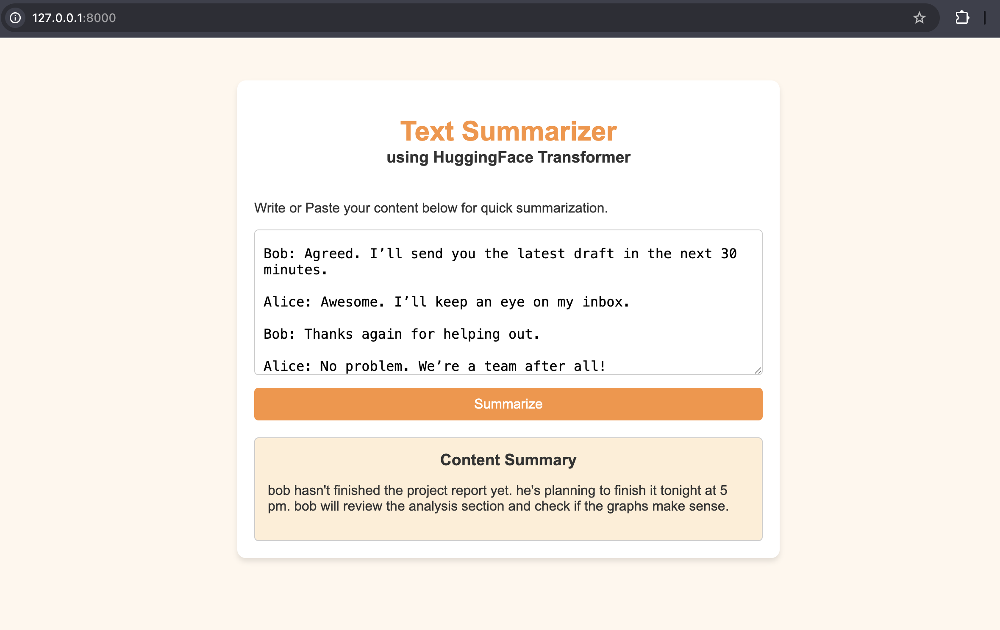

Text Summarizer using T5 and FastAPI

Overview

A web application that summarizes long conversations and text using a fine-tuned T5 Transformer model. The application is built using FastAPI for the backend and HTML for the frontend.

Features

* Text and dialogue summarization
* FastAPI backend
* Interactive web interface
* Transformer-based summarization using T5
* REST API support

Technologies Used

* Python
* FastAPI
* Hugging Face Transformers
* PyTorch
* HTML
* Jinja2

## Demo

### LOOK of Conversation

## Demo

### Input Conversation

Installation

Clone the repository:

git clone <repository-url>

Install dependencies:

pip install -r requirements.txt

Run the application:

uvicorn app:app --reload

Open:

http://127.0.0.1:8000

Example

Input

Rahul: Are we still on track for the project?

Priya: Frontend is almost complete.

Aman: Backend APIs are ready.

Output

The team discussed project progress. Frontend and backend development are nearly complete and the project remains on schedule.

Author

Arnav Singh

B.Tech Computer Science & Engineering